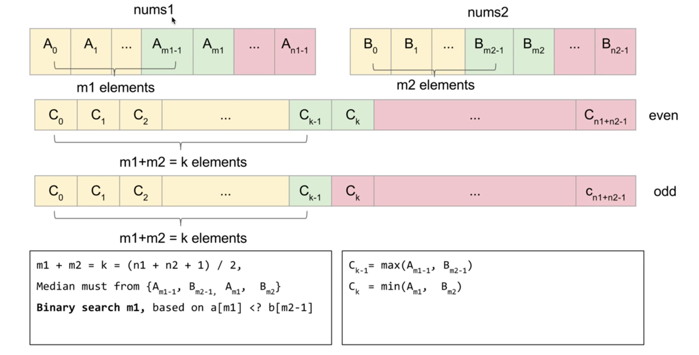

## 问题描述:

给定两个排好序的数组，大小分别为$m$和$n$，找到两个数组的中位数（median），要求时间复杂度不超过$O(log(m+n))$.

**Example 1:**

> nums1 = [1, 3]
>
> nums2 = [2]
>
> The median is 2.0

**Example 2:**

> nums1 = [1, 2]
>
> nums2 = [3, 4]
>
> The median is (2 + 3)/2 = 2.5

###### 补充说明：

**中位数：**是在一组数据中居于中间的数(特别注意的地方是：这组数据之前已经经过升序排列！！！)，即在这组数据中，有一半的数据比它大，有一半的数据比它小。如果这组数据包含偶数个数字，中值是位于中间的两个数的平均值。

## 解决方法:



### 主要思路：

如上图所示，想要找到两个数组合并后的中位数，即寻找 $C_{k-1}$ 和 $C_k$ 的值，即找到合并后数组的第K个元素。

#### 思路1：

依次从数组nums1和nums2数组的头部弹出较小的值，直到找到第K个元素。这种算法的时间复杂度为 $O(m+n)$。

#### 思路2：

假设从nums1中取出前m1个元素，nums2中取出前m2个元素，共同组成合并后数组的前k个元素。当：

$$
A_{m_1}>=B_{m_2-1}\quad\&\&\quad B_{m_2}>=A_{m_1-1}
$$

成立时，才为合理解，否则说明m1取得过大或者过小。

当找到m1时，那么：

$$
C_{k-1}=max(A_{m1-1},B_{m_2-1})
$$

$$
C_k=min(A_{m_1},B_{m_2})
$$

当$(m+n)$为奇数时，中位数为$C_{k-1}$ 。偶数时为$0.5*(C_{k-1}+C_k)$ 。

代码如下：

> Runtime: **69 ms**,  beats 25.76% of cpp submissions.

```cpp
class Solution {
public:
    double findMedianSortedArrays(vector<int>& nums1, vector<int>& nums2) {
        const int n1 = nums1.size();
        const int n2 = nums2.size();
        
        if (n2 < n1) return findMedianSortedArrays(nums2, nums1);
        
        const int k = (n1 + n2 + 1) / 2;

        int l = 0;
        int r = n1;
        
        while (l < r) {
            const int m1 = (l + r) / 2;
            const int m2 = k - m1;
            if (nums1[m1] < nums2[m2 - 1])
                l = m1 + 1;
            else {
                r = m1;
            }
        }
        
        const int m1 = r;
        const int m2 = k - m1;
        
        const int c1 = max(m1 <= 0 ? INT_MIN : nums1[m1 - 1],
                           m2 <= 0 ? INT_MIN : nums2[m2 - 1]);
        
        if ((n1 + n2) % 2) return c1; // even
        
        const int c2 = min(m1 >= n1 ? INT_MAX : nums1[m1],
                           m2 >= n2 ? INT_MAX : nums2[m2]);
        
        return (c1 + c2) * 0.5;
    }
};
```