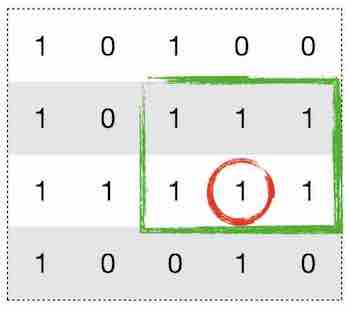
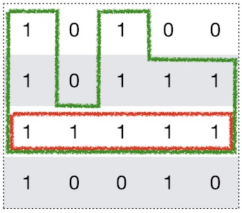

## 问题描述：

给定一个只包含0和1的二维数组，找到只包含1的最大矩形。

例子：

```python
Input:
[
  ["1","0","1","0","0"],
  ["1","0","1","1","1"],
  ["1","1","1","1","1"],
  ["1","0","0","1","0"]
]
Output: 6
```

## 解法：

### 1. 动态规划：

这道题可以用动态规划的方法来解决。对于矩阵中的每个为1的点，以该点为起点向上连一条最长的只包含1的直线。求出包含该直线最大的矩形的面积。所有面积中最大的即为所求。以下图为例，红色点对应的面积即为绿色框所显示的区域。



为了实现上面的思路，我们只需要维护三个标记为left、right、hight的矩阵。面积即为hight * (right - left)。

> [cur_left, cur_right) 	// 当前行包含该点最长的连续1区间
>
> left(i, j) = max(left(i-1, j),  cur_left)
>
> right(i, j) = min(right(i-1, j), cur_right) 
>
> height(i, j) += 1, if matrix[i][j]=='1'; 
>
> height(i, j) = 0, if matrix[i][j]=='0'

以上面的例子为例，最终left、right、hight三个矩阵分别为：

```python
# left
[0, 0, 2, 0, 0]
[0, 0, 2, 2, 2]
[0, 0, 2, 2, 2]
[0, 0, 0, 3, 0]

# right
[1, 5, 3, 5, 5]
[1, 5, 3, 5, 5]
[1, 5, 3, 5, 5]
[1, 5, 5, 4, 5]

# height
[1, 0, 1, 0, 0]
[2, 0, 2, 1, 1]
[3, 1, 3, 2, 2]
[4, 0, 0, 3, 0]
```

#### 代码实现：

```python
class Solution(object):
    def maximalRectangle(self, matrix):
        """
        :type matrix: List[List[str]]
        :rtype: int
        """
        
        if not matrix:
            return 0
        
        # DP
        m, n = len(matrix), len(matrix[0])
        left = [0] * n
        right = [n] * n
        hight = [0] * n
        max_area = 0
        
        for i in range(m):
            
            # left
            curr_left= 0
            for j in range(n):
                if matrix[i][j] == '1':
                    left[j] = max(curr_left, left[j])
                else:
                    left[j] = 0
                    curr_left = j + 1
                    
            # right
            curr_right = n
            for j in range(n - 1, -1, -1):
                if matrix[i][j] == '1':
                    right[j] = min(curr_right, right[j])
                else:
                    right[j] = n
                    curr_right = j
            
            # hight
            for j in range(n):
                if matrix[i][j] == '1':
                    hight[j] += 1
                else:
                    hight[j] = 0
                
            # area
            for j in range(n):
                curr_area = (right[j] - left[j]) * hight[j]
                max_area = max(max_area, curr_area)
                
        return max_area
```

### 2. 基于LeetCode 84题的O(n^2)解法

对于每一行构造出以当前行为底的柱状图，然后利用LeetCode 84题的解法，对每一行求解。最终求出最大的矩形。以下图为例，对于红色行，构造的柱形图即为绿色框所围起来的。



#### 代码实现：

```python
class Solution(object):
    def maximalRectangle(self, matrix):
        """
        :type matrix: List[List[str]]
        :rtype: int
        """
        
        if not matrix:
            return 0
        
        m, n = len(matrix), len(matrix[0])
        height = [0] * (n + 1)
        
        ans = 0
        for i in range(m):
            for j in range(n):
                if matrix[i][j] == '1':
                    height[j] += 1
                else:
                    height[j] = 0
                    
            # solution for LeetCode 84
            stack = [-1]
            for j in range(n + 1):
                while height[j] < height[stack[-1]]:
                    h = height[stack.pop()]
                    w = j - stack[-1] - 1
                    ans = max(ans, w * h)
                stack.append(j)
            
        return ans
```

