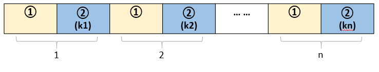

问题：给定两个字符串s、m，初始长度都为1。定义两种操作：

> 1. m = s, s = 2s
> 2. s = s + m

问给定长度L时，最少要经过多次操作1和2，才能让s的长度为L。

### 解题思路：

我们可以发现，无论执行多少个操作1和操作2都可以，用下面这种通式表示：



> * 以操作1开始，是因为s和m的初始值都是1，无论第一步执行操作1还是操作2，得到s、m的状态都为(m = 1, s = 2.)
> * 操作2中的kn表示执行kn次操作2，其中kn >= 0。

#### 推导s的通项公式：

如图所示，我们可以把操作1加上kn个操作2定义为一个大操作。下面我们来推到，经过n个大操作后s的长度。

> 设经过第 $j$ 个操作1后，m的长度为 $m_j$，则经过第 $j$ 个大操作后：
>
> $$
> s_j =  (k_j + 2) \times m_j
> $$
>
> 又因为 $m_j = s_{j-1}$，所以有：
>
> $$
> s_j = (k_j + 2) \times s_{j-1}
> $$
>
> 因 $s_0 = 1$，所以s长度的通向公式为：
>
> $$
> s_n = (k_n + 2)(k_{n-1}+2)\times ~...~ \times (k_2 + 2)(k_1 + 2)
> $$
>
> 此时，经过的操作总数为：
>
> $$
> O_n = \sum_{i=1}^n k_i + n
> $$
>

所以整个问题变成了给定$s_n$后求$O_n$的最小值。

#### 求解最少操作数：

对比操作1、2，可以发现同样的次数，操作1能够使s的长度更快的增长。所以问题也就变成当$L = s_n$时，n越大，所经过的总操作数$O_n$越小。因为$s_n$是n个大于等于2的因子连乘的形式，求n的最大值就变成了对$s_n$分解质因数后，所拆成的练乘因子个数。

### 程序设计：

首先根据，L的最大值，建立最大值$<=L/2$的素数表。然后对输入的L进行质因数分解。
$$
L=P_nP_{n-1}\times~...~P_2P_1
$$

那么最小操作数为：

$$
min(O) = \sum_{i=1}^n (P_i-2)+n=\sum_{i=1}^n(P_i-1)
$$

### 程序实现:

#### [Python](http://nbviewer.jupyter.org/github/chunchengwei/chunchengwei.github.io/blob/master/_posts/notebook/Interview_P1.ipynb)

#### C++:

```cpp
#define MAX_PN 1000
```

