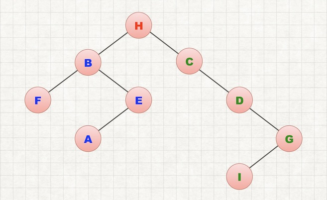

给定二叉树的前序、中序、后续遍历其中两种，如何构造？

## 1. 给定前序、中序遍历

> In-order: F, B, A, E, H, C, D, I, G
>
> Pre-order: H, B, F, E, A, C, D, G, I

由于前序遍历最先访问根节点。可以确定H为根节点。而中序遍历的顺序为：左子树、根、右子树。所以可以确定中序遍历中，H前面的所有元素构成左子树。后面的所有元素构成右子树。由此可以做如下划分：

> In-order: F, B, A, E, H, C, D, I, G
>
> Pre-order: H, B, F, E, A, C, D, G, I

其中红色为根节点、蓝色为左子树、绿色为右子树。

然后递归的对左子树和右子树做同样的操作。最终构建的二叉树为：

---

同理，给定其他遍历顺序时，颜色划分如下。

## 2. 给定后序、中序遍历

> In-order: F, B, A, E, H, C, D, I, G
>
> Post-order: F, A, E, B, I, G, D, C, H

## 3. 给定前序、后序遍历

> Pre-order: H, B, F, E, A, C, D, G, I
>
> Post-order: F, A, E, B, I, G, D, C, H

这种情况下，我们首先能判断根节点是H，接下来是如何判断左右子树。

由于后序遍历最后访问根节点。所以根节点之前的所有元素，构成了以该点为根的子树。通过先序遍历，我们知道B是左子树的根节点。在后序遍历中找到B，那么B前面的所有节点即为左子树。因此我们就找到了左右子树。如下：

> Pre-order: H, B, F, E, A, C, D, G, I
>
> Post-order: F, A, E, B, I, G, D, C, H

对左右子树进行同样的操作，即可得到整个树。

---

**后记：**

遇到给定二叉树的两种遍历序列后，求第三种遍历序列都可以用上述的方法，先构建出树。再给出另外一种遍历序列。