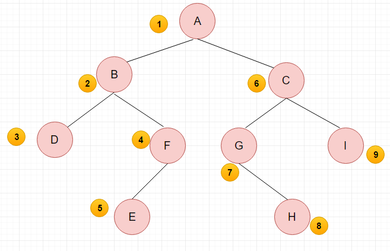
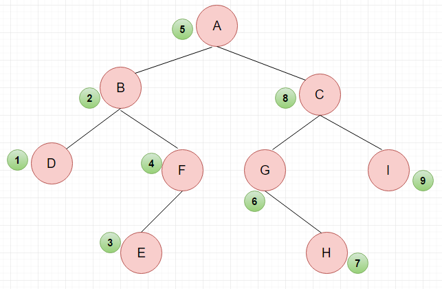
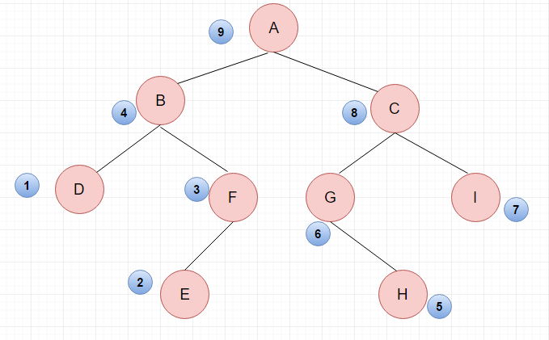
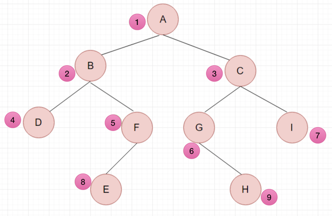

二叉树的知识点及遍历方法整理。

## 1. 什么是二叉树？

>二叉树是每个结点最多有两个分支的树结构。通常被称作“左子树”和“右子树”。二叉树的分支具有左右次序，不能随意颠倒。

## 2. 二叉树种类

### 2.1 斜树

> 所有节点只有左子树，或者右子树。

### 2.2 满二叉树

> 一个二叉树，如果每一个层的结点数都达到最大值，则这个二叉树就是满二叉树。

### 2.3 完全二叉树

> 除了最后一层允许填不满外，其他层均填满。而且最后一层靠左填充。

### 2.4 二叉搜索树

> 左子树上所有节点值 < 根节点 < 右子树上所有节点值。
>
> 二叉搜索树在中序遍历下单调递增。

### 2.5 平衡二叉树

> 左右两个子树的高度差绝对值不超过1。并且左右子树均为平衡二叉树。
>
> 常用算法有：
>
> * 红黑树
> * AVL
> * Treap
> * 伸展树

## 3. 二叉树性质

1. 二叉树第i层，节点数目最多为$2^{i-1}$
2. 任意一颗二叉树，若叶节点为n，度为2的接单树为m，则n = m + 1
3. 深度为h的满二叉树，节点数为$2^h-1$。 由该点引申的性质：
   * 深度为h的二叉树，最多有$2^h-1$个节点
   * 具有n个节点的满二叉树，深度为$\log_2^{n + 1}$
   * 包含n个节点的二叉树，高度至少为$[\log_2^{n+1}]$，[ ]为向下取整
4. 完全二叉树，从上到下从左到右依次编号。若某节点编号为k，则其左右子树根节点编号分别为2k和2k + 1（证明提示，每一行的起点的编号为$2^{i - 1}$）

## 4. 遍历二叉树

> 二叉树，有深度遍历和广度遍历。深度遍历有前序、中序以及后序三种遍历方法，广度遍历即我们寻常所说的层次遍历。
>
> 由于树的定义本身就是递归定义，因此采用递归的方法去实现树的三种遍历不仅实现简单并且易于理解。而对于广度遍历来说，须要其他数据结构的支撑，比如堆。

### 4.1 前序遍历：

> 1. 访问根节点
> 2. 前序遍历左子树
> 3. 前序遍历右子树

### 4.2 中序遍历：

> 1. 中序遍历左子树
> 2. 访问根节点
> 3. 中序遍历右子树

### 4.3 后序遍历：

> 1. 后续遍历左子树
> 2. 后续遍历右子树
> 3. 访问根节点

### 4.4 层序遍历：

> 从上到下，从左到右，依次访问

---

## 更新历史

* 2018-12-21：更新二叉搜索树、平衡二叉树。