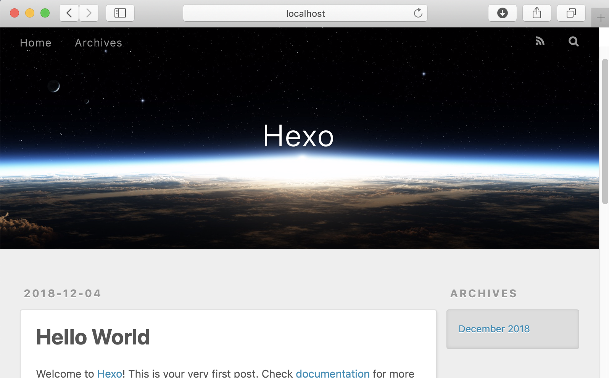

## 1. 准备知识

首先我们需要先了解一下docker的常用命令和hexo的常用命令

##### Docker准备知识：

```bash
# ****************************** 容器 ****************************** #
# 查看正在运行的容器
$ docker ps
# 查看所有容器
$ docker ps -a
# 启动/停止某个容器
$ docker start/stop id/name
# 以交互方式启动一个容器
$ docker start -i id/name
# 进入某个容器(使用exit退出后容器也跟着停止运行)
$ docker attach id/name
# 启动一个伪终端以交互式的方式进入某个运行的容器（使用exit退出后容器不停止运行）
$ docker exec -it id/name
# 删除某个容器
$ docker rm id/name
# 复制ubuntu容器并且重命名为test且运行，然后以伪终端交互式方式进入容器，运行bash
$ docker run --name test -ti ubuntu /bin/bash

# ****************************** 镜像 ****************************** #
# 查看本地镜像
$ docker images
# 删除某个镜像
$ docker rmi id/name
# 基于当前目录下的Dockerfile，创建一个名为name:flag的镜像
$ docker build -t name:flag .
```

你可能还需要了解一点Docker Compose的知识：

> Docker Compose 是 Docker 容器进行编排的工具，定义和运行多容器的应用，可以一条命令启动多个容器。
>
> 使用Compose 基本上分为三步：
>
> 1. Dockerfile 定义应用的运行环境
> 2. docker-compose.yml 定义组成应用的各服务
> 3. docker-compose up -d 启动整个应用
> 4. docker-compose down 停止整个应用

官方文档：

1. [Get started with Docker](https://docs.docker.com/get-started/)
2. [Get started with Docker Compose](https://docs.docker.com/compose/gettingstarted/)

##### Hexo准备知识：

hexo的安装和使用非常简单，官网给出的教程如下，前提是你已经有了一个node的环境。

```bash
$ npm install hexo-cli -g
$ hexo init blog
$ cd blog
$ npm install
$ hexo server
```

## 2. 使用Docker搭建一个hexo环境

首先下载并安装社区版本[Docker CE](https://www.docker.com/get-started)。安装好后，你就可以在终端中调用Docker的指令了。我们先拉取一个node镜像。

```bash
# 由于目前hexo不支持最新的 node11.3.0 所以选用node长期支持版10.14.1
$ docker pull node:10
```

创建你博客的工作目录，这里我们以 "~/Hexo" 为例：

```bash
$ mkdir -p ~/Hexo && cd ~/Hexo

# 创建存放Dockerfile的文件夹
$ mkdir hexo_docker && cd hexo_docker

# 创建Dockerfile
$ touch Dockerfile
```

Dockerfile文件内容如下：

```docker
# *****************************************************************************
# File Name: Dockerfile
# Auther: Chuncheng Wei
# Email: weicc1989@gmail.com
# Created Time: Fri Nov 30 23:08:07 2018
# Description:
#
#     This bases on node:10 image
#
# *****************************************************************************


# 基础镜像
FROM node:10

# 维护者信息
MAINTAINER your_name <your_mail>

# 工作目录
WORKDIR /hexo

# 安装Hexo
RUN npm install hexo-cli -g
RUN hexo init .
RUN npm install

# 设置git
RUN git config --global user.name "your_name"
RUN git config --global user.email "your_mail"

# 映射端口
EXPOSE 4000

# 运行命令
CMD ["/bin/bash"]
```

基于Docker文件创建 hexo:10 镜像：

```bash
$ docker build -t 'hexo:10' .
```

此时，我们就有了一个可以折腾hexo镜像了，而且在镜像的/hexo目录下我们也已经初始化好了hexo博客的环境。执行下面的命令，我们就可以看到目前拥有的docker镜像了。

```bash
$ docker images
REPOSITORY          TAG                 IMAGE ID            CREATED             SIZE
hexo                10                  3cae20f1d074        8 seconds ago       1.01GB
node                10                  d330537fea0f        5 days ago          893MB
```

此时我们就可以看下初步的效果了，在终端中使用镜像hexo:10以交互模式启动一个容器，将容器的 4000 端口映射到主机的 4000 端口，主机的目录 $HOME/.ssh 映射到容器的 /root/.ssh，并在容器内执行 /bin/bash 命令。

```bash
$ docker run -it --name="temp" -p 4000:4000 -v $HOME/.ssh:/root/.ssh hexo:10 /bin/bash

# 会进入容器的bash环境，显示如下。@后面的一串数字和字母是容器的id
root@b3f600327b99:/hexo#
```

在这个环境下执行 hexo s 然后用本地浏览器打开：[http://localhost:4000](http://localhost:4000) 即可预览你的博客了。显示如下：

```bash
root@b3f600327b99:/hexo# hexo s
INFO  Start processing
INFO  Hexo is running at http://localhost:4000 . Press Ctrl+C to stop.
```



## 3. 使用hexo-theme-matery主题

此时我们只搭好了一个hexo的基础环境。接下来我们制作一个使用hexo-theme-matery的docker镜像。

主题的下载地址为：

[https://github.com/blinkfox/hexo-theme-matery](https://github.com/blinkfox/hexo-theme-matery)

主题的说明文档：

[https://github.com/blinkfox/hexo-theme-matery/blob/develop/README_CN.md](https://github.com/blinkfox/hexo-theme-matery/blob/develop/README_CN.md)

主题主要依赖的npm包如下：

```bash
# 代码高亮
$ npm i -S hexo-prism-plugin
# 搜索
$ npm install hexo-generator-search --save
# 中文链接转拼音（可选的）
$ npm i hexo-permalink-pinyin --save
# 添加RSS订阅支持（可选的）
$ npm install hexo-generator-feed --save
```

下面我们介绍两种搭建方法，一种搭建简单，但工作目录比较复杂。另一种搭建繁琐，但目录结构简单。

简单方法搭建好后目录如下：

```bash
$ ls
_config.yml  docker-compose.yml  node_modules       package.json  scaffolds  themes
db.json      hexo_docker         package-lock.json  public        source     yarn.lock
```

复杂方法搭建好后目录如下：

```bash
$ ls
_config.yml  docker-compose.yml  hexo_docker  scaffolds  source  themes
```

### A. 简单搭建方法：

以最终工作目录为 ~/Blog 为例：

#### 创建新镜像

首先创建用于创建新镜像的Dockerfile文件，文件命名为Dockerfile_matery

```bash
$ cd ~/Hexo/hexo_docker
$ touch Dockerfile_matery
```

Dockerfile_matery 内容如下：

```docker
# *****************************************************************************
# File Name: Dockerfile_matery
# Auther: Chuncheng Wei
# Email: weicc1989@gmail.com
# Created Time: Fri Nov 30 23:08:07 2018
# Description:
#
#     This bases on node:10 image
#
# *****************************************************************************


# 基础镜像
FROM hexo:10

# 维护者信息
MAINTAINER your_name <your_mail>

# 工作目录
WORKDIR /hexo

# 安装Hexo插件
RUN npm i -S hexo-prism-plugin
RUN npm install hexo-generator-search --save
RUN npm i hexo-permalink-pinyin --save
RUN npm install hexo-generator-feed --save
RUN npm install hexo-deployer-git --save

# 映射端口
EXPOSE 4000

# 运行命令
CMD ["/usr/bin/env", "hexo", "server"]
```

创建镜像和容器

```bash
$ cd ~/Hexo
# 创建镜像
$ docker build -t 'temp:10' -f Dockerfile_matery ./hexo_docker
# 创建容器并启动
$ docker run -it --name="simple" -p 4000:4000 -v $HOME/.ssh:/root/.ssh -v $PWD/simple:/hexo temp:10 /bin/bash
```

#### 启动容器，并设置主题

进入容器后，初始化hexo博客

```bash
$ hexo init .
```

另开一个终端，下载[hexo-theme-matery](https://github.com/blinkfox/hexo-theme-matery)主题，并按[说明文档](https://github.com/blinkfox/hexo-theme-matery/blob/develop/README_CN.md)设置。

切回到容器终端，就可以执行各种hexo的指令了。

```bash
# 生成静态网页，并布置到网站上，前提设置好_config.yml文件中的deploy参数
$ hexo g -d
# 本地访问http://localhost:4000预览
$ hexo s
```

下次重启容器只需要输入下面指令即可：

```bash
$ docker start -i simple
```

---

#### 创建服务

此时简单方法的搭建已经完成。这种方法的好处就是简单，而且可以随时在容器中执行操作。跟本地环境几乎没区别。很方便。如果你觉得每次启动容器后还要输入命令，比较麻烦。那么就可以参照下面的教程写一个docker 的服务文件，即docker-compose.yml：

把相关文件都整合到simple目录下：

```bash
$ cp -r ~/Hexo/hexo_docker ~/Hexo/simple
$ cd ~/Hexo/simple
$ touch docker-compose.yml
```

docker-compose.yml文件：

```docker
version: '3'
services:
  blog:
    restart: always
    build:
        context: hexo_docker
        dockerfile: Dockerfile_matery
    image: temp:10
    container_name: temp_simple
    ports:
      - "4000:4000"
    volumes:
     - $HOME/.ssh:/root/.ssh
     - $PWD:/hexo
```

这样启动服务时，容器就自动执行Dockerfile中写好的CMD指令，即hexo serve。启动和关闭服务如下：

```bash
$ docker-compose up -d 	# 启动整个应用
$ docker-compose down 	# 停止整个应用
```

### B. 复杂搭建方法

为了尽量简化博客目录，我们可以把不相关的文件保存在Docker镜像里。在博客目录只保留内容相关的文件。

首先我们先列出需要保留的目录和文件：

* docker相关：
  * docker-compose.yml    服务配置文件
  * hexo_docker/    用于存放Dockerfile文件
* hexo相关：
  * scaffolds/    存放模版文件
  * source/        存放用户资源文件，post，draft
  * themes/      存放主题
* git相关：
  * .deploy_git/    hexo-deployer-git插件用于存放commit历史记录。

其中.deploy_git/目录如果不保留在本地会导致每次都重新commit全部文件导致远程的库会越来越大。

简化目录的思路就是把上述文件留在本地然后每次启动应用时挂在到容器内部即可。这里我们以目录~/hexo/complex为例，讲述搭过程：

#### 筹备工作（将上述文件复制到complex目录）：

```bash
$ mkdir -p ~/hexo/complex
$ cd ~/hexo/simple
$ cp -r _config.yml docker-compose.yml hexo_docker scaffolds source themes .deploy_git/ ../complex
$ cd ~/hexo/complex
```

当然你也可以通过其他的方式获得上述文件复制到complex文件夹即可。

#### 修改Dockerfile_matery文件：

```docker
# 基础镜像
FROM hexo:10

# 维护者信息
MAINTAINER your_name <your_mail>

# 工作目录
WORKDIR /hexo

# 安装Hexo插件
RUN npm i -S hexo-prism-plugin
RUN npm install hexo-generator-search --save
RUN npm i hexo-permalink-pinyin --save
RUN npm install hexo-generator-feed --save
RUN npm install hexo-deployer-git --save

# 挂载volume
VOLUME ["/hexo/.deploy_git", "/hexo/scaffolds", "/hexo/source", "/hexo/themes", "/root/.ssh"]

# 映射端口
EXPOSE 4000

# 运行命令
CMD ["/usr/bin/env", "hexo", "server"]
```

与simple的相比只是添加挂载volume一项。

#### 修改docker-compose.yml文件

```docker
version: '3'
services:
  blog:
    restart: always
    build:
        context: hexo_docker
        dockerfile: Dockerfile_matery
    image: blog:matery
    container_name: blog
    ports:
      - "4000:4000"
    volumes:
     - $HOME/.ssh:/root/.ssh
     - $PWD/.deploy_git:/hexo/.deploy_git
     - $PWD/scaffolds:/hexo/scaffolds
     - $PWD/source:/hexo/source
     - $PWD/themes:/hexo/themes
     - $PWD/_config.yml:/hexo/_config.yml
```

同样也只是把本地文件挂载到容器中。

此时就已经完成了，运行方法如下：

```bash
$ cd ~/hexo/complex
# 启动应用，此时即可访问http://localhost:4000 查看效果
$ docker-compose up -d

# 创建新post
$ docker exec blog hexo new post "your_post_name"

# 生成静态网页并发布
$ docker exec blog hexo g -d

# 停止应用
$ docker-compose down
```

任何hexo的指令都可以通过前面加上docker exec blog来执行。其中blog为容器名。

当然为了方便也可以在.bashrc中添加如下语句

```bash
alias hexo="docker exec blog hexo"
```

这样就可以在终端中直接执行 hexo g -d 之类的语句了，而不用加上前面 docker exec blog

---

## 4. 结语

至此，整个环境就搭建完了。

如何建立远程分支将hexo博客的源码和生成的静态文件push到不同的分支上可以参阅：

[Hexo建分支Push源文件到仓库](https://o--o.win/Website/Hexo_set_branch/)

插入图片的问题可以参阅：

[Hexo插本地图不借助插件和图床](https://o--o.win/Website/HexoPic/)

这是个很棒的解决方案。

以及如何插入jupyer notebook，以及基于原主题的一些修改，我会整理到下一篇博客里。