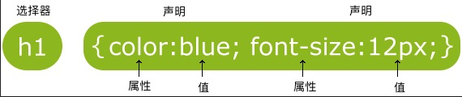

这几天使用hexo-theme-matery的主题搭建Blog时，发现主题的很多设计不是很喜欢。所以就想自己动手改一下，于是也就有了这篇博客。在讲修改之前先说一下如果你和我一样也是0基础，却想要修改别人的主题，要做哪些准备。

## 准备工作：

我们想要展示一个blog，所有的工作最终都是为了要生成html的网页文件。所以我们需要学习一点html的概念。

HTML 是用来描述网页的一种语言。是一种标记语言。css定义了网页的样式，而js定义了网页的行为。

你可以通过下面的链接，快速学习一下 html、css 和 js：

* [菜鸟教程 | HTML](http://www.runoob.com/html/html-intro.html)
* [菜鸟教程 | CSS](http://www.runoob.com/css/css-tutorial.html)
* [菜鸟教程| JavaScript](http://www.runoob.com/js/js-tutorial.html)

这里我把一些很关键的点列出来。这样就算你不去学习上面的教程也能够了解到大致的原理。

### HTML知识点：

#### 1. HTML网页结构


所以这就是为什么会看到很多教程说把此段代码添加到head内。

#### 2. 网页的布局


很多主题都通过定义以下HTML代码：&lt;div id="nav"&gt;、&lt;div class="header"&gt; 或者 &lt;div id="footer"&gt; 来指明导航链接、头部以及尾部。当你想要修改哪些部分时，首先尝试去寻找对应区域的关键词，迅速定位要修改代码的位置。

#### 3. HTML速查列表

当你大致了解了HTML之后。这里有一份HTML的速查列表，你可以打印它，已备日常使用：

[菜鸟教程 | HTML 速查列表](http://www.runoob.com/html/html-quicklist.html)

### CSS知识点：

#### 1. CSS 语法

css定义了HTML中的元素的样式。CSS规则主要由两部分组成：选择器，以及一条或者多条声明构成：



选择器通常是你想要修改样式的 HTML 元素，声明则是你要修改属性和样式。

#### 2. 选择器

选择器分为两种：

* ID选择器：以 "#" 来定义
* class选择器： 以 "."来定义

以下的样式规则应用于元素属性 id="para1":

```css
#para1
{
    text-align:center;
    color:red;
}
```

在以下的例子中，所有拥有 center 类的 HTML 元素均为居中。

```css
.center {
    text-align:center;
}
```

选择器支持嵌套，在以下的例子中，card类中所有 center 类的 HTML 元素均为居中

```css
.card .center {
	text-align:center;
}
```

还有一种情况，即多个元素用同样的格式，此时用逗号分隔即可。

### JS知识点：

通过上面的js的教程，你会发现 js和 c的语法真的很像。所以如果你会c的语法，那么基本上可以看懂js的代码。

下面重点说一下ejs，因为我用的主题就使用的ejs。

#### 1. 什么是ejs？

EJS 是一套简单的模板语言，帮你利用普通的 JavaScript 代码生成 HTML 页面。EJS 没有如何组织内容的教条；也没有再造一套迭代和控制流语法；有的只是普通的 JavaScript 代码而已。这是[官网](https://ejs.bootcss.com)给出的介绍。下面只列举出一些知识点，教程可以在官网上看见。

#### 2. ejs标签含义：

- `<%` '脚本' 标签，用于流程控制，无输出。
- `<%_` 删除其前面的空格符
- `<%=` 输出数据到模板（输出是转义 HTML 标签）
- `<%-` 输出非转义的数据到模板
- `<%#` 注释标签，不执行、不输出内容
- `<%%` 输出字符串 '<%'
- `%>` 一般结束标签
- `-%>` 删除紧随其后的换行符
- `_%>` 将结束标签后面的空格符删除

#### 3. 引入其他模版

比如下面的代码就是将"article/list.ejs" 文件载入到当前ejs里，并传递参数count、page、list。

```js
<%- include("article/list",{
    count : locals.count,
    page : locals.page,
    list : locals.list
})%>
```

---

有了以上这些准备工作就基本完事了。现在你就可以去看theme中的代码了，迅速定位到要修改的位置，然后在网上找到想用的样式。修改或添加相应的代码即可。

##### 文中主要链接整理如下，以便查阅：

* [菜鸟教程 | HTML](http://www.runoob.com/html/html-intro.html)
* [菜鸟教程 | CSS](http://www.runoob.com/css/css-tutorial.html)
* [菜鸟教程| JavaScript](http://www.runoob.com/js/js-tutorial.html)
* [菜鸟教程 | HTML 速查列表](http://www.runoob.com/html/html-quicklist.html)
* [EJS 官网](https://ejs.bootcss.com)

今天先写到这里。之后我会讲一下，对于hexo-theme-matery主题，我做了哪些修改，供大家参考。以上如果有不正确或不清楚的地方，欢迎指正。